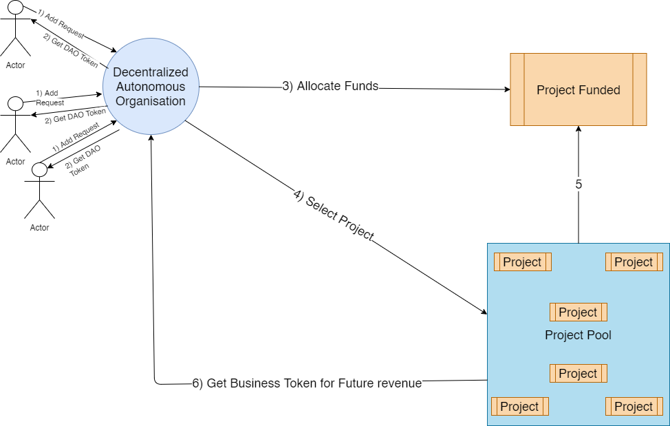

    <h1 align= "center">TIJORI</h1>

## The problem Tijori solves
Tijori Is a robust platform allowing investors to invest money in a upcoming project and hold a stake in the proect throgh tokens that can be traded in future. It works in simple manner.
Lets Suppose you have some money, and you want to invest it, But the money you invest in a project alone can not suffice its demands.

1)You use our platform to create a Decentralised Autonomous Organisation, describe the type of projects you want to invest your money in and set the rules of the DAO.

2) Like Minded people who also want to invest money can also join the DAO, provinding a contribution towards the DAO which would be later used to invest in a project

3) The project owners who need to get there project funded, register there project in your DAO.

4) Members of the DAO make a proposal to the category of project they want to be funded.

5) Members then vote on the available proposals through quadratic voting, to choose a category.

6) Members also choose aproject they want to fund through quadratic funding.

7)The Administrator of the DAO finalises the result and the project is funded. In turn the project provides project tokens to the members of the DAO, allowing them to hold stake in the project.

Future Propoals:
To create a Token Market place allowing trade of tokens like a stock market.

Benefits:
1) Allowing users to invest in areliable blockchain platform.
2) Providing funding to new projects, nurturing innovation
3)Invest money in high return assets.

## Architectural diagram

